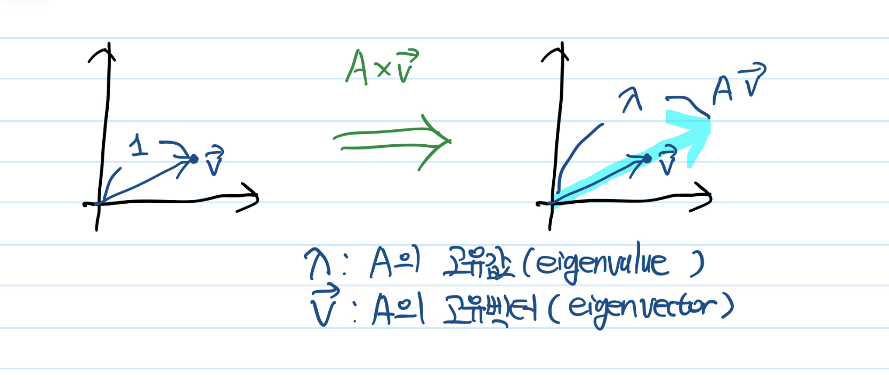
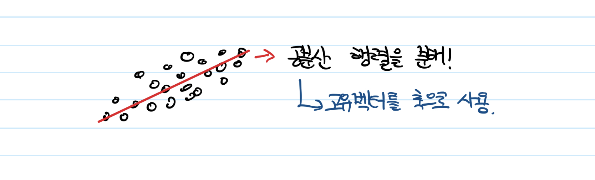

# 고유값(eigen value)와 고유벡터(eigen vector)에 대해 설명해주세요. 그리고 왜 중요할까요?

1줄 답변 : 선형변환으로 해석할 수 있는 정사각 행렬을 어떤 상수값과 1차원 벡터로 표현하는 것이 고유값과 고유벡터이고, 이 성질을 이용해 행렬 분해에 이용할 수 있으며 궁극적으로 차원축소 등과 같은 유용한 기법을 가능하게 하기 때문에 중요하다.

- 고유값의 정의

- PCA : 데이터셋의 공분산행렬을 고유값 분해하여 얻은 고유벡터들이 분산을 가장 크게 만드는 축이 되고, 기존 데이터셋을 이 축에 사영(project)시킨 값을 새로운 데이터셋으로 사용한다.

